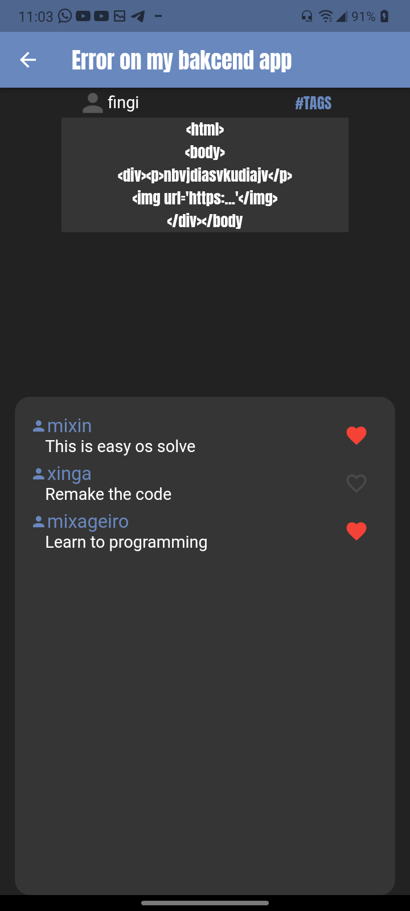

# FastProgramming

Um aplicativo contruído em <a href="https://flutter.dev">Flutter</a> para exemplificar um trabalho da escola.

  

  <a>HomePage</a>
   

   

  <a>Página de detalhes de um post</a>
  

  

  <a>Página de perfil do usuário</a>
  

 

